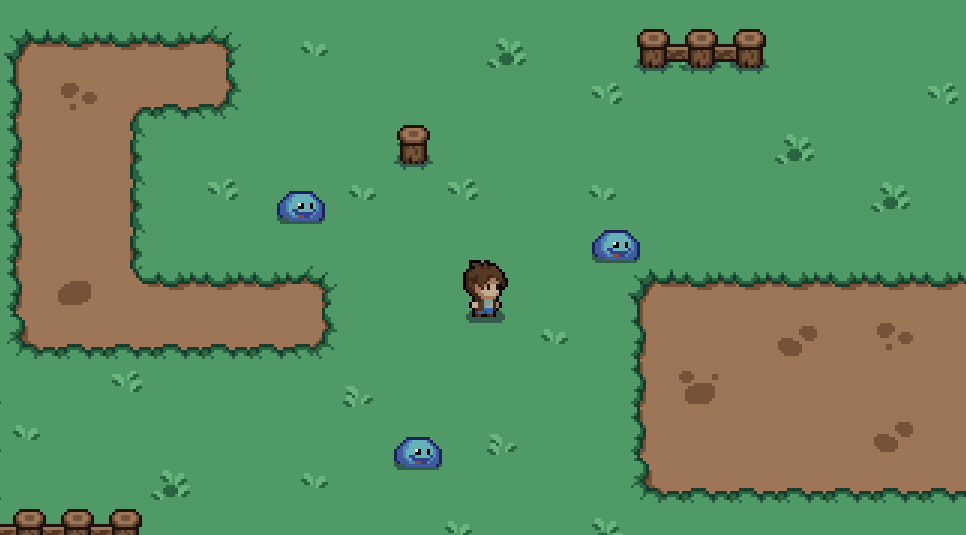

<p align="center">
    
</p>

# Mystic Woods Playground

Mystic Woods Playground is a demo game made just for fun and to learn game development fundamentals.

## 🎨 Assets

The game assets were made by [Game Endeavor](https://game-endeavor.itch.io/mystic-woods).

## 🖥️ Technologies

This game was developed using the following technologies:

- [Unity](https://unity.com/)
- [C#](https://docs.microsoft.com/en-us/dotnet/csharp/)

## ✨ Features

- Top-down camera
- Camera follows player
- Sword attack
- Enemies
- Controller inputs

## 🎮 How to run this game

You can run this game by cloning this repository to your machine and executing through the Unity Hub.

```bash
$ git clone https://github.com/ledoctah/Mystic-Woods-Playground.git
$ cd Mystic-Woods-Playground
```

After cloning it, you can open your Unity Hub and just hit the play button.

## 📝 License

This project is under the [MIT license](./LICENSE). Feel free to download and edit as you want.

Made with 💖 by [Matheus Ferreira](http://github.com/ledoctah)

[](https://www.linkedin.com/in/o-matheus-ferreira/)
